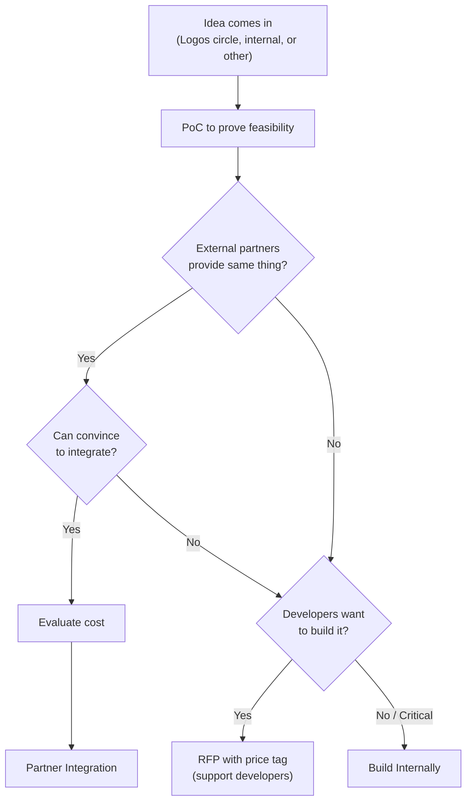
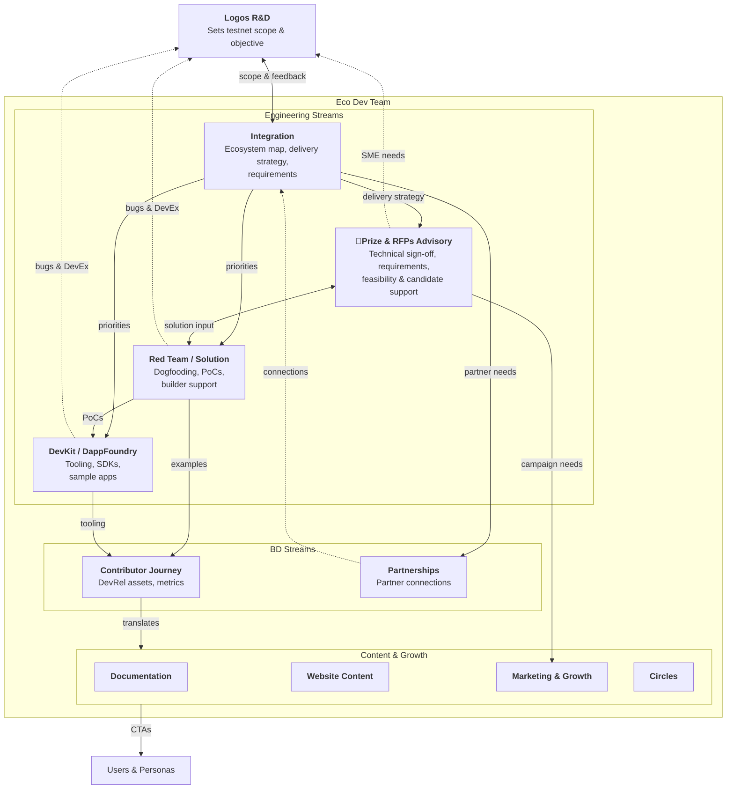

Home of the Logos Ecosystem Development Engineering effort.

# Mandate

Enable bi-directional feedback between the Logos technical stack and the Logos community/ecosystem. By:

- Identifying and evaluating the technological needs of the community and ecosystem
- Translating those needs into requirements for the technology stack and value of said requirements
- Propagating information about latest delivery, to encourage the community to use, build, remix and contribute back to the Logos Technology stack
- Provided (solution) engineering capabilities for ecosystem development activities.

# Monthly Priorities

## Feb 2026

- Progress on atomic swap sample app - set FURPS and start development
- Progress on multsig wallet - set FURPS and continue development
- Progress on scaffold - set FURPS and start development
 - Review infra essentials (eg block explorer), understand R&D delivery scope and review need for partners (rolled over)
 - Agree and set process for docs handover

## Dec-Jan 2025

- Set a scope of work for Eco Dev Engineering for [[milestones/testnet_v0_1|testnet_v0_1]]
  - Start smart contract dogfooding and scaffold - highest priority
  - Consider desired apps, review requirements, and plan PoCs for them
  - Review infra essentials (eg block explorer), understand R&D delivery scope and review need for partners
- Validation matrix work postponed (might touch on it)

# Work In Progress

[GitHub Project](https://github.com/orgs/logos-co/projects/11/views/1)

See [Build internally, with Partner, via RFP or via Lambda Prize?](#build-internally-with-partner-via-rfp-or-via-lambda-prize)

Plan so far:

1. [Multi-sig sample app](https://github.com/logos-co/ecosystem/milestone/8)
2. [Atomic Swaps sample app](https://github.com/logos-co/ecosystem/milestone/7)
3. [Scaffold Dev Kit](https://github.com/logos-co/ecosystem/milestone/9)
4. Forum library (OpChan)
   A forum format seems to be the simplest and easiest form for a first activity hub. Re-use Opchan protocol but in new stack
5. P2P Marketplace

## Build internally, with Partner, via RFP or via Lambda Prize?
When do we want to build internally, find a partner, or push an RFP or a Lambda Prize?

Lambda Prize is meant for complicated and ambitious project. Huge challenges where we do not dictate the solution. We're looking at a category of problem and put a price to solve it.
We let someone else draft the product requirements and solution.

RFPs are here to outsource development effort, while keeping a tight control on the output.

The other ways are for specific projects or ideas that we, the community, want to see built.

# Concerns / Priorities

> We are still building the house, once ready, we want to invite more people and then decide whether to build a pool or gym next

> Current priorities mainly come from completing an MVP level product and doing the mainnet launch.
> Once done, it will be more realistic to be driven by community feedback. 

> Ideally the R&D Priorities should be set by eco dev findings. Continuous push and pull.

What drives the prioritisation of the requirements forwarded to the Logos contributors?

## (1) [[engineering/concerns/sustainability|Sustainability]]

Enable and drive onchain activity and value accrual to sustain the development of the technology stack for the Movement. Ensure that the L1 comes with battery included aka essentials apps are available at mainnet launch.

## (2) [[engineering/concerns/movement|Movement]]

The end goal, why we are all here. Provide the technological solutions needed by the movement, contributors and participants, circles and people to organise, identified and solve winnable issues. Make the Internet a catalyst for prosperity and emancipation. No one is free until we are all free. See [Logos Manifesto](https://logos.co/manifesto) for the vision, and [Farewell to Westphalia](https://logos.co/farewell-to-westphalia) to open the conversation on how we get there.

## (3) Technology De-Risking

Enable early delivery and validation of technology with most unknowns and risks. Engineering teams flag the risks to get them prioritised accordingly.

# Streams

These are the specific efforts to produce. For how these streams work together during R&D handoffs, see the [[handoff|R&D ↔ Eco Dev Handoff Protocol]].

Red team is pretty much a "maintenance" style effort, with constant/regular interruptions. DevKit is a feature effort, where focus is necessary to deliver a specific piece of software.
Team members are likely to shift from one effort to another, as long as their role at a given time is clear, to ensure software delivery.

## Red Team / Solution
**Mandate:** Extended dogfooding of R&D delivery + Solution engineering for builders inc. ꟛPrize and partners

**Competency**: Solution / Architect - deep understanding on how to use the full Logos stack

**Outputs:**
- GitHub Issues documenting bugs, edge cases, confusion points (GitHub label: `from eco dev`)
- DevEx evaluation (reports/issues)
- Feature requests
- Review of documentation from Eco Dev Doc team.
- Sample (PoCs) applications to test code and ensure appropriate developer/user experience; also to explore specific desired projects and learn about feasibility
- ADR (Architect Decision Records), functional and technical requirements (FURPS)
- Builder support (mentorship, technical assistance, solution engineering)

**Feedback to:** Logos R&D and DevKit **on** bugs, desired features emerging for usage and developer experience, Doc team on docs.

## DevKit / DappFoundry
**Mandate:** Build tooling and SDKs for Logos development

**Competency**: Tooling, scripting, blockchain development, full software cycle

**Outputs:**
- Logos Scaffold: local dev environment for Logos Blockchain and Core, with templates apps
- SDK wrappers in other languages for Logos Core
- Template apps and examples (polished reference implementations, can be adapted from sample apps)

**Feedback to:** Logos R&D **on** bugs, desired features emerging for usage and developer experience

**Note**: The tooling produced by DevKit is **not** a workaround for API issues.

## Integration
Partner/Internal integration focus

**Mandate:** Ensure ecosystem essentials ("batteries included") are delivered; prioritise with R&D; feedback to delivery (internal, ꟛPrize, partnerships)

**Competency**: Partner Management, Technical Product Management, Requirements Engineering

**Outputs:**
- Ecosystem map: dependencies and priorities across desired projects, app essentials, infra essentials
- Delivery strategy: re-use, partnership, ꟛPrize, or build internally
- Product requirements definition
- Value Proposition Mapping: map Logos features to partner/lead use cases and pain points
- Integration Requirements: document partner technical requirements for prioritisation
- Case Studies: document successful integrations/partnerships for credibility

**Feedback to:** whole Eco Dev Team, Logos R&D **on** priorities with regards to desired apps and related essentials

## Lambda Prize and RFPs Engineering Advisory

**Mandate:** Ensure the quality of RFPs and Lambda Prizes deliverables.

**Competency:** Solution Engineers, technical product specification and architect review.

**Outputs:**
- ꟛPrize and RFPs technical requirements, scoping and estimation (as [PRs](https://github.com/logos-co/rfp/pulls))
- Input on ꟛPrize and RFPs' dependencies, feasibility and priorities
- Applications' (as in proposals) technical and architectural sign-off
- Technical sign-off of ꟛPrize and RFPs' deliverables
- Pulling in SME (Logos R&D) when necessary
- Support candidates on their delivery

# Testnet Scope Flow

**Translation:** Testnet scope requires technical translation into priorities and execution order.
- **Integration** translates to: Engineering teams (Red Team, DevKit, Contributor Journey) + BD
- **Contributor Journey** translates to: Documentation, Website Content, Marketing & Growth