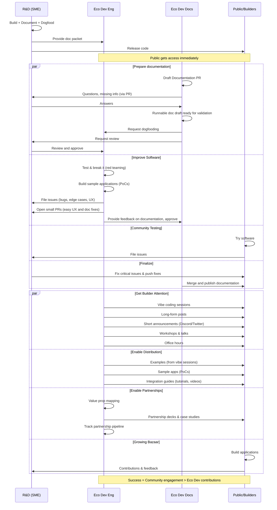

**R&D builds it. Eco Dev breaks it, then evangelizes it. Both succeed together.**

---

## Philosophy

### Red Team Role

Eco Dev acts as **guaranteed co-developers** - the first external developers to stress-test technology:

- **Permission to break**: Misuse, stress test, find edge cases
- **Permission to be confused**: If experienced Eco Dev doesn't understand it, community won't either
- **Permission to say "no"**: Can flag software as not ready
- **No blame culture**: Finding issues is success, not failure

### Documentation Team Role

The documentation team is responsible for turning internal knowledge into documentation that users can execute correctly on the first attempt.

- **Build the documentation framework**: Create and maintain the tools that enable consistent docs creation across writers and SMEs—templates, examples, LLM prompts, style guide, repository layout, etc.
- **Identify gaps and drive SME input**: Review existing docs to find missing information, then work with SMEs to obtain draft content or doc packets to close those gaps.
- **Surface unknowns early**: Identify unclear details, conflicting behavior, and ambiguous ownership; track questions and drive them to resolution with SMEs.
- **Improve comprehension**: Apply shared terminology. Rewrite complex information into clear, concise guidance that readers can understand quickly.

### Bazaar Model Alignment

Following Eric Raymond's "The Cathedral and the Bazaar":

**"Given enough eyeballs, all bugs are shallow"** (Linus's Law)

**Red team = Guaranteed eyeballs without gating public access**:

- Public release happens when R&D handoff complete
- Red team tests in parallel with community access
- Red team seeds the bazaar (initial feedback, shallow bugs, use it in examples and PoCs)
- **Goal**: Red team becomes obsolete as community co-developers emerge

---

## Team Ownership

### R&D Delivers

| Deliverable                                                                                                                           | Why?                                                        |
| ------------------------------------------------------------------------------------------------------------------------------------- | ----------------------------------------------------------- |
| **Code**                                                                                                                              | Functioning software is the core of the delivery            |
| **Logos Core Module** (if library)                                                                                                    | Usable in Logos Core, pre-wrapped                           |
| **Protocol, API Specs, FURPS**                                                                                                        | Clear expectation of behaviour and functionality delivered  |
| **Documentation and [doc packet](https://github.com/logos-co/logos-docs/blob/main/docs/_shared/templates/doc-packet-testnet-v01.md)** | To quickly jump into activities, and bypass discovery phase |
| **Dogfooding Proof**                                                                                                                  | Help ensure the above is done and bases are covered         |

### Eco Dev Delivers

**Prerequisite**: Red Team/Solution, DevKit, and Contributor Journey streams must familiarise themselves with Logos R&D features and deliverables before engaging in handoff activities. This ensures effective testing, accurate communication, and quality output.

Eco Dev engineering outputs are organised by **strategic impact** below. For detailed stream responsibilities and outputs, see [[index#What We Do|Eco Dev streams]].

### Eco Dev Does NOT Own

Eco Dev is not responsible for:

- **R&D Process**: Setting priorities, defining roadmap, milestones (including testnet), or generally being involved in the Logos R&D process
- **Initial Documentation**: Producing initial docs, writing specs, FURPS, or APIs (see [[#R&D Delivers]])
- **End-User Facing or Protocol Production Software**: Only developer tools are to be produced by the Eco Dev team
- **Wrapping C-Bindings**: Libraries produced by Logos R&D should be demonstrated usable in Logos Core before handoff.

### Delivery Strategy

For ecosystem essentials identified through handoff activities, the Integration stream determines the delivery approach. See the [[index#Build internally, with a Partner, via RFP or via Lambda Prize?|Build/Partner/Lambda Prize decision flow]].

#### 1. Improve the Software

| Output                | Impact                                                                                                                                                                                                                                                                  |
| --------------------- | ----------------------------------------------------------------------------------------------------------------------------------------------------------------------------------------------------------------------------------------------------------------------- |
| **GitHub Issues**     | Document bugs, edge cases, and confusion points discovered during testing ([label: `from eco dev`](https://github.com/search?q=label%3A%22from+eco+dev%22+org%3Alogos-blockchain%2Clogos-co%2Clogos-storage%2Clogos-messaging+type%3Aissue+is%3Aopen+&type=issues&p=1)) |
| **Documentation PRs** | Fix unclear language, improve structure, ensure LLM-readability                                                                                                                                                                                                         |
| **PoC applications**  | Test the code by building PoCs of applications, ensure appropriate developer and user experience is delivered                                                                                                                                                           |

#### 2. Get Builder Attention

| Output                        | Impact                                                       |
| ----------------------------- | ------------------------------------------------------------ |
| **Vibe Coding Sessions**      | Live, honest exploration showing real developer experience   |
| **Long-form Posts**           | Deep dives on features, use cases, architectural decisions   |
| **Short-form Announcements**  | Discord posts, Twitter threads, release summaries            |
| **Presentations & Workshops** | Conference talks, meetups, hands-on sessions                 |
| **Office Hours**              | Regular Q&A sessions for direct builder support and feedback |

#### 3. Enable Distribution

| Output                 | Impact                                                                                                                                                                |
| ---------------------- | --------------------------------------------------------------------------------------------------------------------------------------------------------------------- |
| **Examples**           | Application code others can fork/reference (could emerge from live vibe coding sessions).                                                                             |
| **PoC applications**   | Demonstrate feasibility and design of specific use cases, enabling more integration opportunities                                                                     |
| **Integration Guides** | Tutorials, videos and other complementary material to documentation and examples to show how Logos integrates with other tools/protocols or enable specific use cases |

#### 4. Enable Partnerships

| Output                        | Impact                                                                                  |
| ----------------------------- | --------------------------------------------------------------------------------------- |
| **Value Proposition Mapping** | Map Logos features to partner/lead use cases and pain points for targeted outreach      |
| **Partnership Decks**         | Create tailored presentations for ecosystem partnerships (VCs, protocols, enterprises)  |
| **Integration Requirements**  | Document partner technical requirements and feed to Integration team for prioritization |
| **Case Studies**              | Document successful integrations/partnerships for sales pipeline and credibility        |
| **Partnership Pipeline**      | Track and nurture potential ecosystem integrations (e.g., protocols using Logos stack)  |

**Stream Ownership Mapping** (see [[index#What We Do|Eco Dev streams]] for stream details):

- **Improve Software**: Red Team/Solution (dogfooding, PoCs, bug reports) + DevKit (tooling feedback)
- **Get Builder Attention**: Contributor Journey (DevRel assets, workshops) + Marketing & Growth (social media, announcements)
- **Enable Distribution**: DevKit (sample apps, tooling) + Contributor Journey (examples, guides)
- **Enable Partnerships**: Business Development (value prop, partner connections, pipeline) + Integration (requirements, delivery strategy)

---

## Workflow

### Documentation focused workflow

| Phase | Owner                | What happens (DoD)                                                                                                                                                                 | Where              | Status          |
| :---: | :------------------- | :--------------------------------------------------------------------------------------------------------------------------------------------------------------------------------- | :----------------- | :-------------- |
|   1   | SME (R&D)            | Provide doc packet/draft; link authoritative resources; answer questions. DoD: packet sufficient for Docs to write a stub.                                                    | Issue              | —               |
|   2   | Docs                 | Create PR linked to issue with initial draft from packet. DoD: doc exists in PR; missing info and questions tracked in issue.                                                 | PR (issue)         | Stub            |
|   3   | Docs                 | Turn stub into runnable draft. DoD: ready for validation with explicit assumptions/unknowns. Note: Red team may be involved before this step to running through the draft. | PR                 | Unverified      |
|   4   | SME (R&D) + Red Team | Parallel validation: SME verifies technical correctness; Red Team tests end-to-end; Docs implement changes. DoD: SME approves and Red Team report = Pass.                     | PR                 | Verified by SME |
|   5   | Docs                 | Final editorial pass (structure, grammar, linters) and publish. DoD: merged and published.                                                                                    | PR (merge) + issue | Verified        |

---

## Success Metrics

Metrics organized by **strategic impact**: software quality, builder attention, and distribution reach.

### 1. Improve the Software

| Metric                | Target                       | Why It Matters                           |
| --------------------- | ---------------------------- | ---------------------------------------- |
| **Issues Filed**      | >3 GitHub issues per release | Validate red team testing rigor          |
| **Documentation PRs** | >=1 PR per handoff           | Improve docs quality and LLM-readability |

### 2. Get Builder Attention

| Metric                        | Target                              | Why It Matters              |
| ----------------------------- | ----------------------------------- | --------------------------- |
| **Vibe Session Views**        | >500 views per session              | Measure DevRel reach        |
| **Long-form Post Engagement** | >1000 reads per post                | Measure deep content impact |
| **Short-form Reach**          | >100 interactions (Discord/Twitter) | Measure awareness spread    |
| **Workshop Attendance**       | >20 attendees per session           | Measure hands-on engagement |

### 3. Enable Distribution

| Metric                       | Target                                        | Why It Matters                |
| ---------------------------- | --------------------------------------------- | ----------------------------- |
| **Example Forks/References** | >10 forks or mentions in 90 days              | Measure code reuse            |
| **External Integrations**    | >1 external project using feature in 6 months | Measure protocol distribution |
| **Community Builds**         | First community application within 60 days    | Validate builder success      |

### 4. Bazaar Health (Overall)

| Metric                          | Target                                        | Why It Matters                        |
| ------------------------------- | --------------------------------------------- | ------------------------------------- |
| **Community Engagement Growth** | Community contributions > Eco Dev (over time) | Success = Eco Dev becomes unnecessary |
| **Self-Service Rate**           | >80% questions answered by docs/Known Issues  | Measure documentation quality         |

---

## Communication

The R&D teams need to have a clear process or roadmap to easily find the artefact for each deliverable (code, docs, etc).

**Handoff initiation**: R&D prompts Eco Dev team in `#ecodev` that a deliverable is done. Pointing to a single artefact (GitHub Issue or roadmap.logos.co page) that contains all information.

**Communication**: Lightweight communication can be done in the R&D's team general Discord channel (e.g. `#messaging-lobby`).

**Eco Dev Artefacts**: As per [[#Eco Dev Delivers]], the nature of artefact will dictate the channel (X live stream, blog post, etc).

**Escalation**: Once open in GitHub, critical issues are brought to the attention of the R&D lead of the software and R&D head. This may include issues from the community.

---

## Applies To

✅ Infrastructure components, developer tools, protocols, major features

❌ Internal tooling, research prototypes, emergency hotfixes

---
