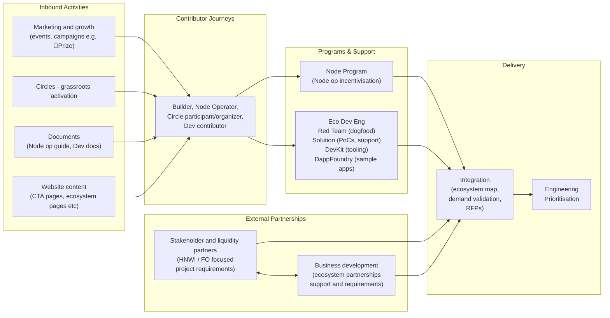
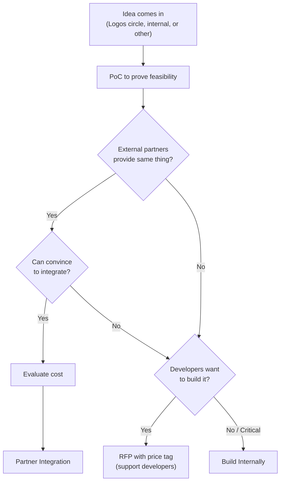
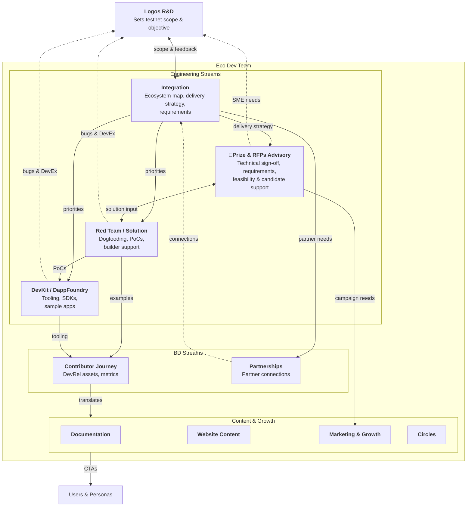

# Eco Dev Team

Home of the Logos **Ecosystem Development** team. We sit between Logos R&D and the wider community/ecosystem: we dogfood and stress-test what R&D ships, build proof-of-concept apps, maintain developer tooling, shape RFPs and Lambda Prizes, and feed real builder and business needs back into the stack. **Eco Dev Engineering** is the engineering effort within this team.

## Team

| Name          | GitHub                                               |
| ------------- | ---------------------------------------------------- |
| James Zaki    | [@jzaki](https://github.com/jzaki)                   |
| Vaclav Pavlin | [@vpavlin](https://github.com/vpavlin)               |
| Danish Arora  | [@danisharora099](https://github.com/danisharora099) |
| Franck        | [@fryorcraken](https://github.com/fryorcraken)       |
| Sasha         | [@weboko](https://github.com/weboko)                 |

## How the sub-teams work together

# Mandate

Enable bi-directional feedback between the Logos technical stack and the Logos community/ecosystem. By:

- Identifying and evaluating the technological needs of the community and ecosystem
- Translating those needs into requirements for the technology stack and value of said requirements
- Propagating information about latest delivery, to encourage the community to use, build, remix and contribute back to the Logos Technology stack
- Providing (solution) engineering capabilities for ecosystem development activities.

# What We Do

The team's work is organised into five streams. Team members shift between streams as priorities demand, as long as their role at a given time is clear to ensure software delivery. For how these streams collaborate during R&D handoffs, see the [[handoff|R&D ↔ Eco Dev Handoff Protocol]].

> Red Team is a "maintenance" style effort, with constant/regular interruptions. DevKit is a feature effort, where focus is necessary to deliver a specific piece of software.

## Red Team / Solution

**Mandate:** Extended dogfooding of R&D delivery + solution engineering for builders (incl. ꟛPrize and partners).

**Competency:** Solution / Architect — deep understanding of how to use the full Logos stack.

**Outputs:**

- Identify and build [[sample_apps|Sample Apps]] as Proof-of-Concepts for specific use cases or mechanisms — to test code, ensure good developer/user experience, and learn about feasibility
- GitHub Issues documenting bugs, edge cases, confusion points (label: `from-eco-dev`)
- DevEx evaluation (reports/issues) and feature requests
- Review of documentation produced by the Eco Dev Doc team
- Architecture Decision Records, functional and technical requirements (FURPS)
- Builder support (mentorship, technical assistance, solution engineering)

**Feedback to:** Logos R&D and DevKit on bugs and desired features; Doc team on docs.

## DevKit / DappFoundry

**Mandate:** Build and maintain tooling and SDKs for Logos development.

**Competency:** Tooling, scripting, blockchain development, full software cycle.

**Outputs:**

- [Logos Scaffold](https://github.com/logos-co/scaffold): local dev environment for Logos Blockchain and Core, with template apps
- [spel](https://github.com/logos-co/spel): DevKit tooling
- SDK wrappers in other languages for Logos Core
- Template apps and examples (polished reference implementations, can be adapted from sample apps)

**Feedback to:** Logos R&D on bugs and desired features emerging from usage and developer experience.

**Note:** The tooling produced by DevKit is **not** a workaround for API issues.

## Integration & Demand

**Mandate:** Ensure ecosystem essentials ("batteries included") are delivered; identify which components the community should build (via RFP or Lambda Prize); prioritise with R&D; express business and application needs back to Logos R&D.

**Competency:** Partner Management, Technical Product Management, Requirements Engineering.

**Outputs:**

- Ecosystem map: dependencies and priorities across desired projects, app essentials, infra essentials
- Delivery strategy: re-use, partnership, ꟛPrize, or build internally (see decision flow below)
- Product requirements definition; business and application needs expressed to R&D
- Value Proposition Mapping: map Logos features to partner/lead use cases and pain points
- Integration Requirements: document partner technical requirements for prioritisation
- Case Studies: document successful integrations/partnerships for credibility

**Feedback to:** whole Eco Dev Team, and Logos R&D on priorities for desired apps and related essentials.

## ꟛPrize & RFPs Engineering Advisory

**Mandate:** Technical ownership of RFPs and Lambda Prizes — write and review RFPs and prizes, and review submissions. Ensure the quality of RFP and Lambda Prize deliverables.

**Competency:** Solution Engineers, technical product specification and architecture review.

**Outputs:**

- ꟛPrize and RFP technical requirements, scoping and estimation (as [PRs](https://github.com/logos-co/rfp/pulls))
- Input on ꟛPrize and RFP dependencies, feasibility and priorities
- Technical and architectural sign-off of proposals (applications)
- Technical sign-off of ꟛPrize and RFP deliverables
- Pulling in SME (Logos R&D) when necessary
- Support candidates on their delivery

## Contributor Journey & DevRel

**Mandate:** Help identify and promote what contributors, users and other community members can do with the stack via [journeys](https://journeys.logos.co); run workshops at physical events.

**Competency:** DevRel, technical writing, community engagement.

**Outputs:**

- Contributor and user journeys mapping what can be built and done with the Logos stack
- Workshops and hands-on sessions at physical events
- DevRel assets, examples and integration guides
- Metrics on builder engagement and reach

# Build internally, with a Partner, via RFP or via Lambda Prize?

When do we want to build internally, find a partner, or push an RFP or a Lambda Prize?

Lambda Prize is meant for complicated and ambitious projects — huge challenges where we do not dictate the solution. We're looking at a category of problem and put a price to solve it. We let someone else draft the product requirements and solution.

RFPs are here to outsource development effort while keeping tight control on the output.

The other ways are for specific projects or ideas that we, the community, want to see built.

# Concerns / Priorities

> We are still building the house; once ready, we want to invite more people and then decide whether to build a pool or gym next.

> Current priorities mainly come from completing an MVP level product and doing the mainnet launch. Once done, it will be more realistic to be driven by community feedback.

> Ideally the R&D priorities should be set by eco dev findings. Continuous push and pull.

What drives the prioritisation of the requirements forwarded to the Logos contributors?

1. **Sustainability** — Enable and drive onchain activity and value accrual to sustain the development of the technology stack for the Movement. Ensure that the L1 comes with batteries included, i.e. essential apps are available at mainnet launch.
2. **Movement** — The end goal, why we are all here. Provide the technological solutions needed by the movement, contributors and participants, circles and people to organise, identify and solve winnable issues. Make the Internet a catalyst for prosperity and emancipation. No one is free until we are all free. See the [Logos Manifesto](https://logos.co/manifesto) for the vision, and [Farewell to Westphalia](https://logos.co/farewell-to-westphalia) to open the conversation on how we get there.
3. **Technology De-Risking** — Enable early delivery and validation of technology with the most unknowns and risks. Engineering teams flag the risks to get them prioritised accordingly.

# Monthly Priorities

## Feb 2026

- Progress on atomic swap sample app — set FURPS and start development
- Progress on multisig wallet — set FURPS and continue development
- Progress on scaffold — set FURPS and start development
- Review infra essentials (e.g. block explorer), understand R&D delivery scope and review need for partners (rolled over)
- Agree and set process for docs handover

## Dec-Jan 2025

- Set a scope of work for Eco Dev Engineering for [[milestones/testnet_v0_1|testnet_v0_1]]
  - Start smart contract dogfooding and scaffold — highest priority
  - Consider desired apps, review requirements, and plan PoCs for them
  - Review infra essentials (e.g. block explorer), understand R&D delivery scope and review need for partners
- Validation matrix work postponed (might touch on it)

# Goals

See the [Eco Dev Eng GitHub Project board](https://github.com/orgs/logos-co/projects/11/views/1).

1. Dogfood and software for [Testnet v0.1](https://roadmap.logos.co/testnets/v01). See [[milestones/testnet_v0_1|Testnet v0.1]].
   1. Priority on [LEE/LEZ user journeys](https://github.com/logos-co/ecosystem/milestone/4)
2. Build Multi-Sig sample app v0.1. [Milestone](https://github.com/logos-co/ecosystem/milestone/8).
3. Build Atomic Swaps sample app v0.1. [Milestone](https://github.com/logos-co/ecosystem/milestone/7).
4. Build [Scaffold Devkit](https://github.com/logos-co/scaffold) v0.1. [Milestone](https://github.com/logos-co/ecosystem/milestone/9).
5. Build Forum sample app v0.1 (based on opchan protocol) as a base for circle CMS and activity hub use cases.

Note: AMM sample app has been built by the LEE/LEZ team.

# Testnet Scope Flow

**Translation:** Testnet scope requires technical translation into priorities and execution order.

- **Integration** translates to: Engineering teams (Red Team, DevKit, Contributor Journey) + BD
- **Contributor Journey** translates to: Documentation, Website Content, Marketing & Growth

# Processes

- [[handoff|R&D ↔ Eco Dev Handoff Protocol]]
- [[sample_apps|Sample Apps]]

# Milestones

- [[milestones/testnet_v0_1|Testnet v0.1]]

# Resources

- [Logos website](https://logos.co)
- [Logos Docs](https://github.com/logos-co/logos-docs) (documentation website is WIP)
- [Journeys](https://journeys.logos.co)
- [Flywheels](https://friendly-carnival-n3z5zww.pages.github.io/) ([repo](https://github.com/logos-co/flywheels.logos.co))
- [Eco Dev Eng GitHub Project board](https://github.com/orgs/logos-co/projects/11/views/1)
- DevKit: [scaffold](https://github.com/logos-co/scaffold) · [spel](https://github.com/logos-co/spel)
- [RFPs](https://github.com/logos-co/rfp/pulls) · [Ecosystem milestones](https://github.com/logos-co/ecosystem/milestones)

# Content Authorship

This wiki uses AI assistance to draft and organise content. To maintain transparency, LLM-generated sections that haven't been human-reviewed are marked with an indicator placed immediately after the section header:

> [!ai-generated]
> This section was generated by an LLM and has not yet been human-reviewed.

The indicator applies to the entire section (from the header through all subsections until the next same-level or higher-level header). Once content is reviewed and approved by a human contributor, this indicator is removed. Unmarked content has been human-curated.
