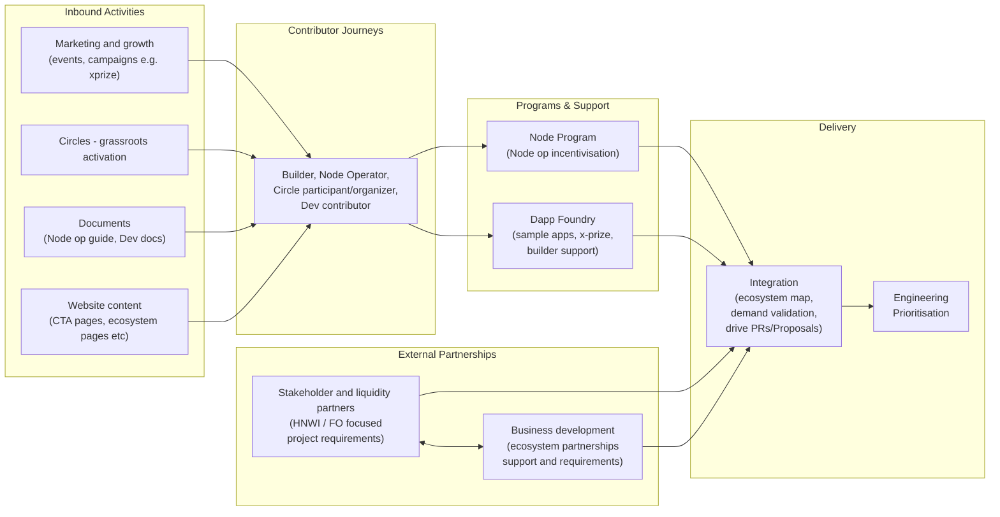

Ecosystem Development Wiki.

Currently private, yet, may become public. Be sure to not push any confidential information.
# Eco Dev Team

## How the sub-teams work together

# Streams

- [[integration/index|Integration]]
## Content Authorship

This wiki uses AI assistance to draft and organize content. To maintain transparency, LLM-generated sections that haven't been human-reviewed are marked with an indicator placed immediately after the section header:

> [!ai-generated]
> This section was generated by an LLM and has not yet been human-reviewed.

The indicator applies to the entire section (from the header through all subsections until the next same-level or higher-level header). Once content is reviewed and approved by a human contributor, this indicator is removed. Unmarked content has been human-curated.

