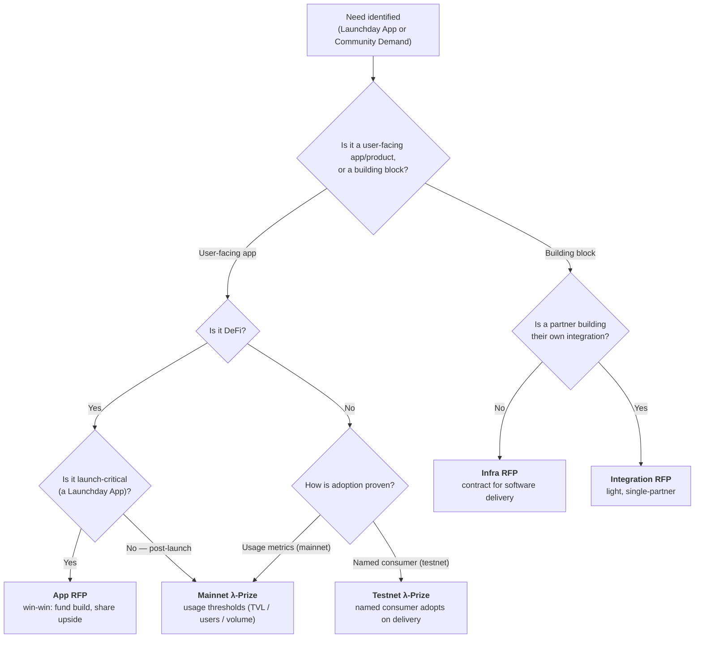

# Logos Ecosystem Development Engineering

Home of the Logos **Ecosystem Development Engineering** ("Eco Dev Eng") team. We sit between Logos R&D and the wider community/ecosystem: we dogfood and stress-test what R&D ships, build proof-of-concept apps, maintain developer tooling, shape RFPs and Lambda Prizes, and feed real builder and business needs back into the stack.

## Team

| Name          | GitHub                                               |
| ------------- | ---------------------------------------------------- |
| Franck (lead) | [@fryorcraken](https://github.com/fryorcraken)       |
| James Zaki    | [@jzaki](https://github.com/jzaki)                   |
| Vaclav Pavlin | [@vpavlin](https://github.com/vpavlin)               |
| Danish Arora  | [@danisharora099](https://github.com/danisharora099) |
| Sasha         | [@weboko](https://github.com/weboko)                 |
| Alisher       | [@xAlisher](https://github.com/xAlisher)             |

# Mandate

Enable bi-directional feedback between the Logos technical stack and the Logos community/ecosystem. By:

- Identifying and evaluating the technological needs of the community and ecosystem
- Translating those needs into requirements for the technology stack and value of said requirements
- Propagating information about latest delivery, to encourage the community to use, build, remix and contribute back to the Logos Technology stack
- Providing (solution) engineering capabilities for ecosystem development activities.

# What We Do

The team's work is organised into five streams, **numbered in priority order**. Team members shift between streams as priorities demand, as long as their role at a given time is clear to ensure software delivery. For how these streams collaborate during R&D handoffs, see the [[handoff|R&D ↔ Eco Dev Handoff Protocol]].

Two of these streams relate as layers: **Journeys** validate and orient people around what Logos R&D delivers, and **RFPs & Lambda Prizes** finance the work built _on top of_ that delivered stack.

## 1. RFPs & Lambda Prizes

RFPs and Lambda Prizes are our **instrument to finance work built on top of the journeys and what Logos R&D delivers**. They fund two types of demand:

1. **Readiness of the stack** — what we want built so the stack is "batteries included"
2. **Demand from users** — what end-users and partners want built (including partner integrations)

The strategic contracting queue is tracked at **[flywheels.logos.co](https://friendly-carnival-n3z5zww.pages.github.io/)** ([repo](https://github.com/logos-co/flywheels.logos.co)): the flywheels, the launch-day apps that serve them, the RFPs and λ-Prizes that deliver each app, and the R&D / sample-app dependencies underneath.

**Mandate:** Identify what to finance (readiness + user/partner demand), choose the delivery vehicle (build internally, partner, RFP, or Lambda Prize — see decision flow below), and own the technical side of RFPs and Lambda Prizes.

**Competency:** Solution Engineers, technical product specification, requirements engineering, and architecture review.

**Outputs:**

- Identification and validation of components the community should build, from both readiness and user/partner demand
- Delivery strategy: re-use, partnership, RFP, or build internally
- λPrize and RFP technical requirements, scoping and estimation (as [PRs](https://github.com/logos-co/rfp/pulls))
- Input on λPrize and RFP dependencies, feasibility and priorities
- Technical and architectural sign-off of proposals (applications) and of deliverables
- Business and application needs expressed back to Logos R&D
- Support for candidates on their delivery; pulling in SME (Logos R&D) when necessary

**Feedback to:** Logos R&D on priorities for desired components and related essentials.

**Ownership:** Sasha ([@weboko](https://github.com/weboko)).

## 2. Journeys

A **journey** is a high-level user story of what Logos R&D (our internal team) is delivering — "here is what someone can do with the stack." Journeys are the spine the team works along to validate and orient people around each R&D delivery.

The prioritised pipeline of journeys is tracked at **[journeys.logos.co](https://journeys.logos.co)** ([repo](https://github.com/logos-co/journeys.logos.co)). Each journey is typed (GUI user, developer, or node operator), tied to a target testnet release, and moves through a lifecycle from R&D delivery to doc packet to dogfooding. The board is sourced from [GitHub Projects](https://github.com/orgs/logos-co/projects/12/views/1).

**Mandate:** For each R&D delivery, identify the journey, then review and dogfood the documentation and journey end-to-end. (The Doc team owns documentation refinement; we review and dogfood it.)

**Competency:** Solution / Architect — deep understanding of the full Logos stack; dogfooding and critical review.

**Outputs:**

- Journeys mapping what people can build and do with the Logos stack
- Review of documentation for each journey (produced by the Doc team)
- Dogfooding / red-teaming of the docs and journey (permission to break — see [[handoff|the Handoff Protocol]])
- GitHub Issues documenting bugs, edge cases, confusion points ([label: `from eco dev`](https://github.com/search?q=label%3A%22from+eco+dev%22+org%3Alogos-blockchain%2Clogos-co%2Clogos-storage%2Clogos-messaging+type%3Aissue+is%3Aopen+&type=issues&p=1))
- DevEx evaluation (reports/issues) and feature requests

**Feedback to:** Logos R&D on bugs and desired features; Doc team on docs.

**Ownership:** Franck ([@fryorcraken](https://github.com/fryorcraken)).

## 3. DevKit

**Mandate:** Build and maintain tooling and SDKs for Logos development.

**Competency:** Tooling, scripting, blockchain development, full software cycle.

**Outputs:**

- [Logos Scaffold](https://github.com/logos-co/scaffold): Rust CLI (`lgs`) and dev harness for the full local loop on two fronts — bootstrapping and running LEZ (Logos Execution Zone) programs (setup, localnet, build, deploy, test nodes, wallet top-ups) and building, installing, and launching Logos modules into the Basecamp app across per-profile environments
- [spel](https://github.com/logos-co/spel): developer framework for building SPEL programs (proc macros → IDL generation, CLI with TX submission, project scaffolding) — inspired by Anchor for Solana
- SDK wrappers in other languages for Logos Core
- Template apps and examples (polished reference implementations, can be adapted from sample apps)

**Feedback to:** Logos R&D on bugs and desired features emerging from usage and developer experience.

**Note:** The tooling produced by DevKit is **not** a workaround for API issues.

**Ownership:** scaffold — Sasha ([@weboko](https://github.com/weboko)); spel — Vaclav ([@vpavlin](https://github.com/vpavlin)).

## 4. Builder Support & Workshops

**Mandate:** Provide hands-on engineering support to builders and run workshops at physical events.

**Competency:** Solution engineering, mentorship, community engagement.

**Outputs:**

- Builder support: mentorship, technical assistance, solution engineering (incl. λPrize candidates and partners)
- Workshops and hands-on sessions at physical events
- Examples and integration guides that emerge from supporting builders

## 5. Sample Apps

**Mandate:** Build [[sample_apps|Sample Apps]] as Proof-of-Concepts — a tool to document and verify more complex usage of the stack and show feasibility.

**Competency:** Application development, solution engineering — building end-to-end apps on the stack to prove feasibility.

**Outputs:**

- Sample apps (PoCs) demonstrating feasibility and more complex stack usage
- Architecture Decision Records, functional and technical requirements (FURPS)
- Feasibility findings fed back into Journeys and RFP/Lambda Prize scoping

**Ownership:** Currently — multisig: Vaclav ([@vpavlin](https://github.com/vpavlin)); atomic swaps: Danish ([@danisharora099](https://github.com/danisharora099)); Forum: James ([@jzaki](https://github.com/jzaki)). A sample app may hand over between releases.

# λ-Prizes vs RFPs

RFPs and λ-Prizes are the two instruments we use to finance work the community builds on top of the stack. The core distinction is **what is being financed**:

- **RFP** — a building block, reusable primitive, or infra that is _built on_, not adopted. Tight spec, contractor model, milestone payment.
- **λ-Prize** — a user-facing app or product a consumer can _try_ and _adopt_. We define the outcome, not the solution; the win condition is **adoption, not mere completion**.

## What drives setting one up

Two inputs trigger an RFP or λ-Prize:

- **Launchday Apps** — components that must be "batteries included" for mainnet launch.
- **Community Demand** — what the ecosystem wants built, surfaced by Circles or by partner integrations.

## RFP types

- **Infra RFP** — we contract for software delivery (a building block / primitive / infra). Tight spec, milestone-based payment.
- **App RFP** — a win-win agreement to push an application to users and/or operate infra: Logos funds the build and the builder shares in the upside. This is the instrument for DeFi or launch-critical apps that cannot be a λ-Prize.
- **Integration RFP** — a light, single-partner RFP to help finance integration with a key partner (partner-as-builder). Scoped to that partner, deliverable-based, committed payment.

## λ-Prize stages

A λ-Prize declares one stage; the stage sets how adoption is proven (the two are mutually exclusive):

- **Testnet λ-Prize** — a non-DeFi prize with a **named consumer** that would adopt it on delivery (a Circle, a sample-app integration, or a partner-as-consumer). Not published until that consumer exists.
- **Mainnet λ-Prize** — DeFi and non-DeFi prizes whose success is **adoption/usage thresholds** (TVL, active users, volume). No named consumer; the market is the consumer.

> DeFi splits on launch-criticality. A DeFi deliverable **needed for mainnet launch** cannot be a λ-Prize (testnet adoption is hollow with no real value to transact, and it must exist _before_ launch) — use a win-win **App RFP**. A DeFi deliverable that is **not** launch-critical can be a **Mainnet λ-Prize**, proven by post-launch usage.

## Choosing the instrument

For the full λ-Prize process, see the λPrize Detailed Process and Internal Guidelines — an [internal Notion doc](https://app.notion.com/p/3308f96fb65c80cea47fc46a5059ce6e) (access required; not public).

# Project Board

Current goals and in-flight work are tracked on the [Eco Dev Eng GitHub Project board](https://github.com/orgs/logos-co/projects/11/views/1).

# Processes

- [[handoff|R&D ↔ Eco Dev Handoff Protocol]]
- [[sample_apps|Sample Apps]]

# Resources

- [Logos website](https://logos.co)
- [Logos Docs](https://docs.logos.co)
- [Eco Dev Eng GitHub Project board](https://github.com/orgs/logos-co/projects/11/views/1)
- DevKit: [scaffold](https://github.com/logos-co/scaffold) · [spel](https://github.com/logos-co/spel)
- [RFPs](https://github.com/logos-co/rfp/pulls) · [Ecosystem milestones](https://github.com/logos-co/ecosystem/milestones)
