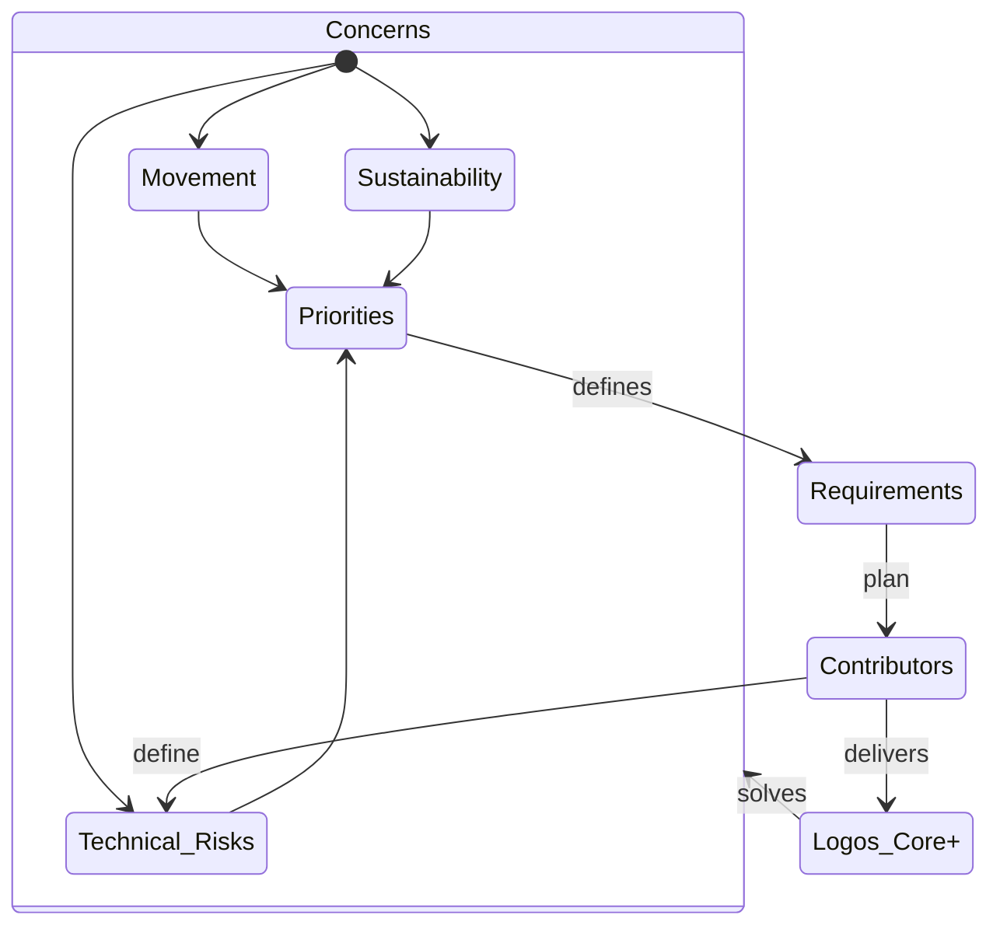
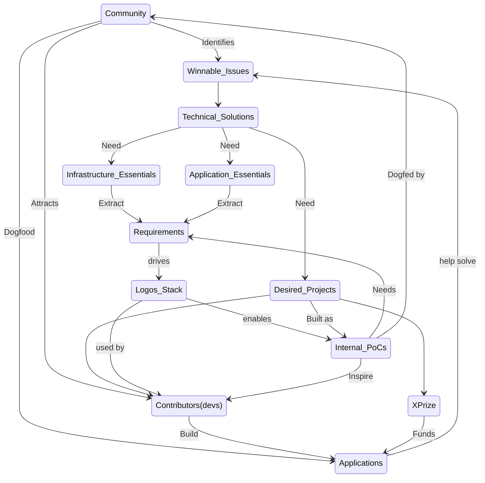

Home of the Logos Ecosystem Development / Integration effort.

# Mandate

(wip): enable bi-directional feedback between the Logos technical stack and the Logos community/ecosystem. By:

- Identifying and evaluating the technological needs of the community and ecosystem
- Translating those needs into requirements for the technology stack and value of said requirements
- Propagating information about latest delivery, to encourage the community to use, build, remix and contribute back to the Logos Technology stack

# Monthly Priorities

## Dec-Jan 2025

- Set a scope of work for Eco Dev Engineering for testnet v0.1. See https://github.com/logos-co/ecosystem/pull/21
  - Consider desired apps, review requirements, and plan PoCs for them
  - Review infra essentials (eg block explorer), understand R&D delivery scope and review need for partners
  - Start smart contract dogfooding and scaffold
- Validation matrix work postponed (might touch on it)

# Methodology

- Understand and synthetise Logos roadmap and testnet phases
- Review dependencies, in terms of technical decisions and delivery. Flag specific integrations that are blocked on progress until decision is made/clarified:
  - Infrastructure essentials (block explorer, rpc, etc): Is there a dependency on RPC format (ETH), SR vs base layer, what ecosystem can be re-used (eth vs stellar ), etc.
  - Application essentials/developer toolkit (SC toolchain, dev env, token creation, onchain primitives, UI, etc): internal requirements on blockchain and Logos Core
  - Desired projects (stablecoin, lending, entity formation, etc): getting developers to build those projects (demand validation, XPrize), and identify/onboard external projects.

## Prioritization (wip)

## Feedback Cycle (wip)

# Concerns / Priorities

What drives the prioritisation of the requirements forwarded to the Logos contributors?

## (1) [[integration/concerns/sustainability|Sustainability]]

Enable and drive onchain activity and value accrual to sustain the development of the technology stack for the Movement. Ensure that the L1 comes with battery included aka essentials apps are available at mainnet launch.

## (2) [[integration/concerns/movement|Movement]]

The end goal, why we are all here. Provide the technological solutions needed by the movement, contributors and participants, circles and people to organise, identified and solve winnable issues. Make the Internet a catalyst for prosperity and emancipation. No one is free until we are all free. See [Logos Manifesto](https://logos.co/manifesto) for the vision, and [Farewell to Westphalia](https://logos.co/farewell-to-westphalia) to open the conversation on how we get there.

## (3) Technology De-Risking

Enable early delivery and validation of technology with most unknowns and risks. Engineering teams flags the risks to get the prioritised accordingly.
