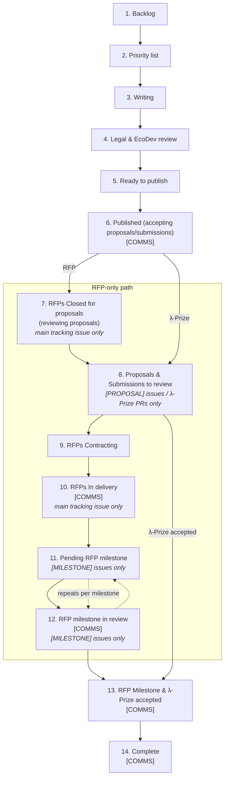

How an RFP or λ-Prize moves from idea to paid-out delivery, and how that movement is tracked on the **[RFP & LPrize Tracking board](https://github.com/orgs/logos-co/projects/18)** (project 18, org `logos-co`). For what an RFP/λ-Prize *is* and which instrument to pick, see [[index#λ-Prizes vs RFPs|λ-Prizes vs RFPs]] on the homepage. This page is about the *pipeline*: the `Status` field on project 18, which kind of GitHub item belongs in which column, and the repo-to-repo choreography behind it.

---

## Repo topology

Tracking is split across three repos, each with a different job:

| Repo | Role |
| --- | --- |
| `logos-co/ecosystem` | Hosts the **main tracking issues** — `[RFP]` / `[Internal RFP]` — one per RFP or λ-Prize, opened while it's being written/reviewed and kept open through delivery. |
| `logos-co/rfp` | Hosts the **published RFP definitions** (`RFPs/RFP-0NN-*.md`) plus the child issues created against them: `[PROPOSAL]` issues (via `.github/ISSUE_TEMPLATE/proposal.yml`) and `[MILESTONE]` issues (via `milestone.yml`, which already instructs "create one per milestone as a sub-issue of the parent proposal issue"). |
| `logos-co/lambda-prize` | Hosts λ-Prize **submissions as pull requests**, not issues — titled `Solution: LP-xxxx — <name>`. This is a structurally different intake mechanism from RFP proposals (see [[#λ-Prize submissions are PRs, not issues]] below). |

## Applies To

✅ RFPs (Infra / App / Integration) and λ-Prizes (Testnet / Mainnet), from first write-up through final payment.

❌ Journeys, sample apps, DevKit tooling, and any other Eco Dev workstream that isn't financed through an RFP or λ-Prize.

---

## The Status pipeline

Project 18's `Status` field is a single-select with 14 values, in pipeline order. Each column's description below is copied verbatim from the field definition on the board.

| # | Status | Description |
| :-: | --- | --- |
| 1 | Backlog | Backlog of write-ups to do |
| 2 | Priority list | Triaged & prioritized ideas, ready to spec |
| 3 | Writing | Eng writing the RFP/LPrize |
| 4 | Legal & EcoDev review | Legal & Ecodev reviews of both RFPs and λ-Prizes before publishing |
| 5 | Ready to publish | Reviewed and legal approved RFPs and λ-Prizes, but pending scheduling/opening. |
| 6 | Published (accepting proposals/submissions) | RFPs open for proposals and λ-Prizes opened for submissions. `[COMMS]` |
| 7 | RFPs Closed for proposals (reviewing proposals) | RFPs closed from proposals, and reviewing them (main tracking issue only). |
| 8 | Proposals & Submissions to review | The actual RFP proposals and λ-Prize submissions to review (no main tracking issues here) |
| 9 | RFPs Contracting | Proposal accepted; legal drafts & sends contract |
| 10 | RFPs In delivery | RFPs in progress (main tracking issues only) `[COMMS]` |
| 11 | Pending RFP milestone | RFP Milestones not yet submitted/approved (milestone issues only) |
| 12 | RFP milestone in review | Grantee submitted a milestone; eng reviewing `[COMMS]` (milestone issues only) |
| 13 | RFP Milestone & λ-Prize accepted | RFP Milestone or λ-Prize submission approved; ready for payment `[COMMS]` |
| 14 | Complete | All milestones complete `[COMMS]` |

Not every item passes through every column — a λ-Prize, for instance, never touches columns 7, 9, 11 or 12 (see [[#λ-Prize submissions are PRs, not issues]]).

### The `[COMMS]` rule

Any column whose description carries the literal `[COMMS]` tag means **reaching that status should trigger external communication** — a post, a social media announcement, a Discord/community update. That's columns 6, 10, 12, 13, and 14. Moving an item into one of these columns is a cue to check whether the announcement has gone out, not just a bookkeeping step.

#### λ-Prize publish comms playbook

The `[COMMS]` tag on columns 10, 12, 13, and 14 doesn't yet have a documented concrete procedure — those still rely on judgment call at the time. Column 6 (**Published (accepting proposals/submissions)**), however, does have one worked out for λ-Prizes: the known sequence for announcing a λ-Prize the moment it opens for submissions.

1. Post an announcement on [forum.logos.co](https://forum.logos.co) (Discourse) introducing the λ-Prize, following the pattern of an existing example such as [LP-0023: LEZ Program Registry](https://forum.logos.co/t/new-prize-lp-0023-lez-program-registry-2-000/1946). Write it with genuine enthusiasm — this is exciting news, and the tone should read that way, not like a dry status update. The post should invite two audiences at once: potential users, to describe how they'd use the prize and what feature they'd want to see, and developers, to share their work in the topic.
2. Mirror that announcement in Discord's `#builder-hub` channel, linking back to the forum post, keeping the same enthusiastic tone, and open a thread on it inviting the same dual discussion from users and developers.
3. Forward the announcement to a second Discord channel depending on who the λ-Prize's output is aimed at: `#general` if it's end-user/GUI-oriented, `#node-operators` if it's node-operator-oriented.
4. Once the Discord thread exists, close the loop by editing the forum post to backlink it, so the forum post ends up pointing at the Discord discussion too.

### Kind-restricted columns

Several columns are explicitly restricted to one *kind* of GitHub item, called out in their own description text:

| Column | Restricted to |
| --- | --- |
| 7. RFPs Closed for proposals | Main tracking issue (`[RFP]` / `[Internal RFP]`) only — never a `[PROPOSAL]` child |
| 8. Proposals & Submissions to review | `[PROPOSAL]` issues and λ-Prize submission PRs only — never a main tracking issue |
| 10. RFPs In delivery | Main tracking issue only — never a `[PROPOSAL]` child |
| 11. Pending RFP milestone | `[MILESTONE]` child issues only |
| 12. RFP milestone in review | `[MILESTONE]` child issues only |

A consequence: a `[PROPOSAL]` issue and its parent `[RFP]` issue should essentially never sit in the same kind-restricted column at the same time. If a `[PROPOSAL]` issue is found parked in a main-tracking-only column (7 or 10), that's a misplacement to fix, not a valid state.

---

## Category field

Every item also carries a `Category` single-select: `RFP` or `LPrize`. It's what lets the board's filtered views (see [[#Board views]]) split RFP work from λ-Prize work.

**Naming convention used to set it:**

- Title starts `[LP] ...` → `LPrize`.
- Title starts `[RFP] ...`, `[Internal RFP] ...`, `[PROPOSAL] RFP-xxx ...`, `[MILESTONE] RFP-xxx ...` → `RFP`.
- Title is just `RFP-xxx — <name>` with **no bracket prefix** → still `RFP`. This bare-title pattern is an inconsistently-applied convention on some proposal issues (observed on RFP-004, RFP-017, and others) — it looks like it could be a main tracking issue at a glance, but it isn't. Don't rely on the title prefix alone to tell the two apart: check the issue body for the proposal form-template shape (fields like "RFP ID", "Your Project Name", "Team", "Technical Approach") to disambiguate a proposal from a main tracking issue.

---

## Sub-issue linkage

GitHub's native sub-issue relationship (the `addSubIssue` mutation / repo Sub-issues UI) is used to link child issues to their parent `[RFP]` main tracking issue, and which children are linked changes as the RFP moves through the pipeline.

**While an RFP is in column 8 (Proposals & Submissions to review):** every competing `[PROPOSAL]` issue for that RFP must be attached as a sub-issue of the parent `[RFP]` tracking issue — not just the eventual winner (RFP-012, 014, 015, 016, and 017 illustrate this: each has its full set of open proposals linked as sub-issues of the parent).

> **Known platform limitation:** a sub-issue can only have one parent. A proposal that spans two RFPs (an observed real case: `[PROPOSAL] RFP-015 & 016 - LPAD`) can only be linked under one of the two parent RFP issues, not both. There's no clean fix for this — it's a structural gap in the sub-issue feature, documented here so it isn't mistaken for a missed link.

**Once an RFP moves into column 10 (RFPs In delivery):** the `[PROPOSAL]` sub-issues are swapped out —

- Losing proposals are unlinked from the parent, and once closed, removed from the project board entirely (see [[#Closed-issue cleanup]]).
- `[MILESTONE]` issues become the parent's sub-issues instead.

Once an RFP moves into delivery, its proposal sub-issues must be removed and replaced with milestone sub-issues (RFP-001 and RFP-002 illustrate the end state: only milestone sub-issues remain once delivery is underway).

---

## λ-Prize submissions are PRs, not issues

λ-Prize submissions land in `logos-co/lambda-prize` as pull requests titled `Solution: LP-xxxx — <name>`, not as issues. This matters because project 18, as of this writing, contains only Issue-type items — zero PR-type items — so a λ-Prize submission is tracked as its own board item rather than as a sub-issue of anything:

1. When a `Solution: LP-xxxx` PR opens, add the **PR itself** to project 18 (`gh project item-add`), set `Category = LPrize`, `Status = Proposals & Submissions to review`.
2. If that PR closes **without merging** (superseded, withdrawn, rejected attempt), remove it from the board outright — no relinking, just delete the item. If/when a fresh attempt PR opens for the same `LP-xxxx`, add that new PR the same way.
3. On merge/acceptance, set `Status = RFP Milestone & λ-Prize accepted`, then `Complete` once paid out.
4. Rejected or closed-without-merge submissions are never left sitting on the board.

Because a λ-Prize item never has a `[PROPOSAL]`/`[MILESTONE]` issue shape, it structurally can't occupy the RFP-specific-worded columns (7, 9, 11, 12) — see [[#Board views]].

---

## Closed-issue cleanup

Any closed `[PROPOSAL]` issue — the underlying GitHub issue state is `CLOSED`, whether that's a losing proposal after a winner is picked or a withdrawal — is removed from the project 18 board entirely, not just moved to a different `Status`. This applies board-wide, regardless of which repo the closed issue lives in.

## Scope boundary

Everything on this page — moving `Status`, removing closed items from the board, linking/unlinking sub-issues — is a **project-board / GitHub-relationship operation only**. None of it involves editing issue or PR content, and none of it involves actually closing an issue or PR. Closing an issue or PR is the responsibility of the person running that specific RFP or λ-Prize, not something board hygiene should do on its own.

---

## Board views

Project 18 has three board views grouped by `Status`:

- **Pipeline** — the main view, no filter, every item.
- **RFP Pipeline** — filtered to `category:RFP`.
- **λ-Prize Pipeline** — filtered to `category:LPrize` with the five RFP-specific-worded statuses excluded (`RFPs Closed for proposals (reviewing proposals)`, `RFPs Contracting`, `RFPs In delivery`, `Pending RFP milestone`, `RFP milestone in review`), since a λ-Prize item can never structurally occupy them.

Additional per-RFP filtered views also exist (or may exist) for RFPs that are Published or further along the pipeline — one per RFP — not enumerated here.

---

## Proposed GitHub Actions automation (not yet implemented)

Checked items below already exist as workflows (linked below); unchecked items are proposals only. Re-verified 2026-09-22 against the current default branch of each repo (`ecosystem`@`v4`, `rfp`@`master`, `lambda-prize`@`master`) — no workflow in any of the three repos touches project 18 or reacts to `projects_v2_item` events, so all five Tier 1 items below remain unimplemented.

### Existing precedent

None of `logos-co/ecosystem`, `logos-co/rfp`, or `logos-co/lambda-prize` currently has a workflow that touches project 18, and none react to `projects_v2_item` events. But each repo already has a workflow whose pattern a project-18 automation could reuse directly:

| Workflow | Trigger | Pattern worth reusing |
| --- | --- | --- |
| [`logos-co/ecosystem/.github/workflows/add-to-project.yaml`](https://github.com/logos-co/ecosystem/blob/v4/.github/workflows/add-to-project.yaml) | `issues: opened` | Adds new issues to project 11 (Eco Dev Eng) via `actions/add-to-project@v1.0.2` with a PAT — the template for "add new item to project 18" automations. |
| [`logos-co/rfp/.github/workflows/label-proposals.yml`](https://github.com/logos-co/rfp/blob/master/.github/workflows/label-proposals.yml) | `issues: [opened, edited]` | Regexes the issue body for the rendered `### RFP ID` form field to apply a per-RFP label — the template for extracting the RFP number reliably. Parses the rendered *body* field, not the title; titles are inconsistently formatted (see [[#Category field]]). |
| [`logos-co/lambda-prize/.github/workflows/validate-submission.yml`](https://github.com/logos-co/lambda-prize/blob/master/.github/workflows/validate-submission.yml) | `pull_request_target` | Validates LP solution PRs and upserts a single marker-tagged comment — the template for safe untrusted-PR handling and idempotent comment-based notifications. |

**A title-matching caveat found in `lambda-prize` PR titles:** not all submission PRs cleanly match `Solution: LP-xxxx — <name>`. One observed PR used `Solution: LP-0002:` with a colon instead of an em-dash; others reference LP numbers without being submissions at all (e.g. "Open LP-0023: ...", "Close LP-0002, LP-0003..."). Any title-matching automation must anchor strictly on a `^Solution:` prefix, not just "mentions an LP number."

### Tier 1 — low risk, clear precedent, propose doing first

- [ ] **Auto-add new `[PROPOSAL]` issues to project 18 on open** (`logos-co/rfp`) — reuse the `add-to-project` pattern, repointed at project 18, filtered on the `proposal` label (already applied by the existing issue template) or the `[PROPOSAL]` title prefix. Not implemented: `logos-co/rfp` has no `add-to-project`-style workflow at all (its only workflows are `label-proposals.yml` and `mdformat.yml`), and `logos-co/ecosystem`'s [`add-to-project.yaml`](https://github.com/logos-co/ecosystem/blob/v4/.github/workflows/add-to-project.yaml) targets project **11**, not 18.
- [ ] **Auto-add new `Solution: LP-xxxx` PRs to project 18 on open** (`logos-co/lambda-prize`) — same action, `pull_request: opened` trigger, anchored title regex per the caveat above. Not implemented: `logos-co/lambda-prize`'s only workflow is [`validate-submission.yml`](https://github.com/logos-co/lambda-prize/blob/master/.github/workflows/validate-submission.yml) (`pull_request_target`, validation + PR comment only) — it never touches any project board.
- [ ] **Auto-remove items from the board when their issue/PR closes without merging** — pure GraphQL delete, no field-write risk. Matches the existing [[#Closed-issue cleanup]] rule. Not implemented: no workflow in any of the three repos reacts to `issues: closed`/`pull_request: closed` with a project-removal step.
- [ ] **Auto-set the `Category` field** (`RFP` / `LPrize`) on newly-added items — trivial, since the source repo alone disambiguates: anything from `rfp`/`ecosystem` → `RFP`, anything from `lambda-prize` → `LPrize`. Not implemented: no workflow writes any project field in any of the three repos.
- [ ] **Auto-set the `RFP` single-select field when the target option already exists** — reuse `label-proposals.yml`'s body-field-regex approach (parse `### RFP ID`, not the title). Scoped to the case where the `RFP-0NN` option already exists on the field; does *not* cover auto-creating missing options (see below) — those should be flagged instead. Not implemented: [`logos-co/rfp/.github/workflows/label-proposals.yml`](https://github.com/logos-co/rfp/blob/master/.github/workflows/label-proposals.yml) only applies an `RFP-0NN` **label** to the issue — it never calls the Projects GraphQL API or writes a project field, so it's a related but distinct action, not a partial implementation of this one.

### The single-select-option corruption risk

`updateProjectV2Field`'s `singleSelectOptions` argument must be sent with every *existing* option's `id` explicitly included, plus any new option(s) with no `id`. Omitting `id` on existing options regenerates all option IDs and silently wipes every item's existing value for that field, project-wide — not just the new item's.

Given that blast radius, auto-creating a new `RFP-0NN` option should stay a human-reviewed step for at least a first pass — the bot flags "new RFP number detected, no matching board option — needs manual add" rather than creating it itself. The convenience of full automation here doesn't outweigh a mistake that can wipe every item's `RFP` field project-wide.

### Tier 2 — harder, worth doing once Tier 1 is stable

- **Daily scheduled lint that flags (does not auto-fix) items violating the [[#Kind-restricted columns]] rules** — e.g. a `[PROPOSAL]` issue sitting in a main-tracking-issue-only column. Read-only GraphQL, so low risk, but needs a decision on where the report lands: issue comment, summary issue, or chat webhook.
- **Auto-linking `[PROPOSAL]` issues as sub-issues of their parent `[RFP]` tracking issue on open** — valuable, but blocked today on there being no reliable structured RFP-number → parent-tracking-issue mapping. Would require heuristic matching against `ecosystem` issue titles/bodies, which is a real accuracy risk worth calling out before attempting it.

### Tier 3 — flag-only, likely indefinitely

- **Auto-creating new `RFP-0NN` field options** — per the corruption risk above.
- **Swapping proposal sub-issues for milestone sub-issues automatically when `Status` moves to "RFPs In delivery"** — GitHub's `projects_v2_item` webhook has real scoping limitations (it's tied to project activity rather than cleanly to a single repo, and the payload doesn't identify issue "kind" without follow-up API calls). This is also exactly the kind of relationship-editing operation the [[#Scope boundary]] rule argues should stay human-reviewed rather than automated.
- **Posting comms reminders when an item's `Status` enters a `[COMMS]`-tagged stage** — same trigger-mechanics difficulty as above, plus automation can't verify a human actually completed the real-world comms action, so at best this becomes a nag-comment. Would need careful de-duplication (e.g. fire once per item per stage-entry, following `validate-submission.yml`'s marker-comment upsert pattern) to avoid being noisy and ignored.

### Scope of the proposal

Every automation proposed above is scoped to project-board operations only — add item, remove item, set a field, apply a label — never auto-closing issues/PRs or editing their content, consistent with this page's [[#Scope boundary]] rule.

---

## Pipeline at a glance

---

## Status × kind reference table

| Status | RFP main tracking issue | `[PROPOSAL]` issue | `[MILESTONE]` issue | λ-Prize submission PR |
| --- | :-: | :-: | :-: | :-: |
| 1–6 (Backlog → Published) | ✅ | — | — | ✅ (from 6 on) |
| 7. RFPs Closed for proposals | ✅ only | ❌ | — | — |
| 8. Proposals & Submissions to review | ❌ | ✅ only | — | ✅ |
| 9. RFPs Contracting | ✅ | — | — | — |
| 10. RFPs In delivery | ✅ only | ❌ | — | — |
| 11. Pending RFP milestone | — | — | ✅ only | — |
| 12. RFP milestone in review | — | — | ✅ only | — |
| 13–14 (Accepted / Complete) | — | — | ✅ | ✅ |

---
