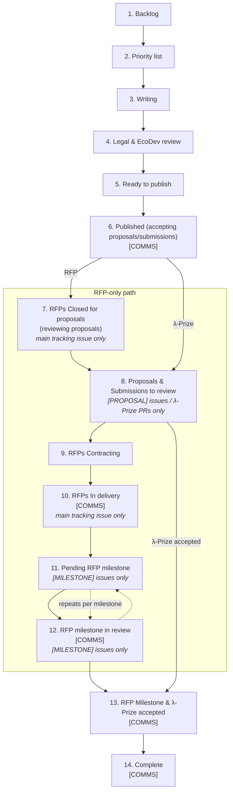

> [!ai-generated]
> This entire document was generated by an LLM and has not yet been human-reviewed.

How an RFP or λ-Prize moves from idea to paid-out delivery, and how that movement is tracked on the **[RFP & LPrize Tracking board](https://github.com/orgs/logos-co/projects/18)** (project 18, org `logos-co`). For what an RFP/λ-Prize *is* and which instrument to pick, see [[index#λ-Prizes vs RFPs|λ-Prizes vs RFPs]] on the homepage. This page is about the *pipeline*: the `Status` field on project 18, which kind of GitHub item belongs in which column, and the repo-to-repo choreography behind it.

---

## Repo topology

Tracking is split across three repos, each with a different job:

| Repo | Role |
| --- | --- |
| `logos-co/ecosystem` | Hosts the **main tracking issues** — `[RFP]` / `[Internal RFP]` — one per RFP or λ-Prize, opened while it's being written/reviewed and kept open through delivery. |
| `logos-co/rfp` | Hosts the **published RFP definitions** (`RFPs/RFP-0NN-*.md`) plus the child issues created against them: `[PROPOSAL]` issues (via `.github/ISSUE_TEMPLATE/proposal.yml`) and `[MILESTONE]` issues (via `milestone.yml`, which already instructs "create one per milestone as a sub-issue of the parent proposal issue"). |
| `logos-co/lambda-prize` | Hosts λ-Prize **submissions as pull requests**, not issues — titled `Solution: LP-xxxx — <name>`. This is a structurally different intake mechanism from RFP proposals (see [[#λ-Prize submissions are PRs, not issues]] below). |

## Applies To

✅ RFPs (Infra / App / Integration) and λ-Prizes (Testnet / Mainnet), from first write-up through final payment.

❌ Journeys, sample apps, DevKit tooling, and any other Eco Dev workstream that isn't financed through an RFP or λ-Prize.

---

## The Status pipeline

Project 18's `Status` field is a single-select with 14 values, in pipeline order. Each column's description below is copied verbatim from the field definition on the board.

| # | Status | Description |
| :-: | --- | --- |
| 1 | Backlog | Backlog of write-ups to do |
| 2 | Priority list | Triaged & prioritized ideas, ready to spec |
| 3 | Writing | Eng writing the RFP/LPrize |
| 4 | Legal & EcoDev review | Legal & Ecodev reviews of both RFPs and λ-Prizes before publishing |
| 5 | Ready to publish | Reviewed and legal approved RFPs and λ-Prizes, but pending scheduling/opening. |
| 6 | Published (accepting proposals/submissions) | RFPs open for proposals and λ-Prizes opened for submissions. `[COMMS]` |
| 7 | RFPs Closed for proposals (reviewing proposals) | RFPs closed from proposals, and reviewing them (main tracking issue only). |
| 8 | Proposals & Submissions to review | The actual RFP proposals and λ-Prize submissions to review (no main tracking issues here) |
| 9 | RFPs Contracting | Proposal accepted; legal drafts & sends contract |
| 10 | RFPs In delivery | RFPs in progress (main tracking issues only) `[COMMS]` |
| 11 | Pending RFP milestone | RFP Milestones not yet submitted/approved (milestone issues only) |
| 12 | RFP milestone in review | Grantee submitted a milestone; eng reviewing `[COMMS]` (milestone issues only) |
| 13 | RFP Milestone & λ-Prize accepted | RFP Milestone or λ-Prize submission approved; ready for payment `[COMMS]` |
| 14 | Complete | All milestones complete `[COMMS]` |

Not every item passes through every column — a λ-Prize, for instance, never touches columns 7, 9, 11 or 12 (see [[#λ-Prize submissions are PRs, not issues]]).

### The `[COMMS]` rule

Any column whose description carries the literal `[COMMS]` tag means **reaching that status should trigger external communication** — a post, a social media announcement, a Discord/community update. That's columns 6, 10, 12, 13, and 14. Moving an item into one of these columns is a cue to check whether the announcement has gone out, not just a bookkeeping step.

### Kind-restricted columns

Several columns are explicitly restricted to one *kind* of GitHub item, called out in their own description text:

| Column | Restricted to |
| --- | --- |
| 7. RFPs Closed for proposals | Main tracking issue (`[RFP]` / `[Internal RFP]`) only — never a `[PROPOSAL]` child |
| 8. Proposals & Submissions to review | `[PROPOSAL]` issues and λ-Prize submission PRs only — never a main tracking issue |
| 10. RFPs In delivery | Main tracking issue only — never a `[PROPOSAL]` child |
| 11. Pending RFP milestone | `[MILESTONE]` child issues only |
| 12. RFP milestone in review | `[MILESTONE]` child issues only |

A consequence: a `[PROPOSAL]` issue and its parent `[RFP]` issue should essentially never sit in the same kind-restricted column at the same time. If a `[PROPOSAL]` issue is found parked in a main-tracking-only column (7 or 10), that's a misplacement to fix, not a valid state.

---

## Category field

Every item also carries a `Category` single-select: `RFP` or `LPrize`. It's what lets the board's filtered views (see [[#Board views]]) split RFP work from λ-Prize work.

**Naming convention used to set it:**

- Title starts `[LP] ...` → `LPrize`.
- Title starts `[RFP] ...`, `[Internal RFP] ...`, `[PROPOSAL] RFP-xxx ...`, `[MILESTONE] RFP-xxx ...` → `RFP`.
- Title is just `RFP-xxx — <name>` with **no bracket prefix** → still `RFP`. This bare-title pattern is an inconsistently-applied convention on some proposal issues (observed on RFP-004, RFP-017, and others) — it looks like it could be a main tracking issue at a glance, but it isn't. Don't rely on the title prefix alone to tell the two apart: check the issue body for the proposal form-template shape (fields like "RFP ID", "Your Project Name", "Team", "Technical Approach") to disambiguate a proposal from a main tracking issue.

---

## Sub-issue linkage

GitHub's native sub-issue relationship (the `addSubIssue` mutation / repo Sub-issues UI) is used to link child issues to their parent `[RFP]` main tracking issue, and which children are linked changes as the RFP moves through the pipeline.

**While an RFP is in column 8 (Proposals & Submissions to review):** every competing `[PROPOSAL]` issue for that RFP is attached as a sub-issue of the parent `[RFP]` tracking issue — not just the eventual winner. This is the existing, consistently-applied practice on the live repo (verified on RFP-012, 014, 015, 016, and 017: each had its full set of open proposals linked as sub-issues of the parent already).

> **Known platform limitation:** a sub-issue can only have one parent. A proposal that spans two RFPs (an observed real case: `[PROPOSAL] RFP-015 & 016 - LPAD`) can only be linked under one of the two parent RFP issues, not both. There's no clean fix for this — it's a structural gap in the sub-issue feature, documented here so it isn't mistaken for a missed link.

**Once an RFP moves into column 10 (RFPs In delivery):** the `[PROPOSAL]` sub-issues are swapped out —

- Losing proposals are unlinked from the parent, and once closed, removed from the project board entirely (see [[#Closed-issue cleanup]]).
- `[MILESTONE]` issues become the parent's sub-issues instead.

This was verified as the existing pattern on RFP-001 and RFP-002, which have zero proposal sub-issues and only milestone sub-issues once in delivery.

---

## λ-Prize submissions are PRs, not issues

λ-Prize submissions land in `logos-co/lambda-prize` as pull requests titled `Solution: LP-xxxx — <name>`, not as issues. This matters because project 18, as of this writing, contains only Issue-type items — zero PR-type items — so a λ-Prize submission is tracked as its own board item rather than as a sub-issue of anything:

1. When a `Solution: LP-xxxx` PR opens, add the **PR itself** to project 18 (`gh project item-add`), set `Category = LPrize`, `Status = Proposals & Submissions to review`.
2. If that PR closes **without merging** (superseded, withdrawn, rejected attempt), remove it from the board outright — no relinking, just delete the item. If/when a fresh attempt PR opens for the same `LP-xxxx`, add that new PR the same way.
3. On merge/acceptance, set `Status = RFP Milestone & λ-Prize accepted`, then `Complete` once paid out.
4. Rejected or closed-without-merge submissions are never left sitting on the board.

Because a λ-Prize item never has a `[PROPOSAL]`/`[MILESTONE]` issue shape, it structurally can't occupy the RFP-specific-worded columns (7, 9, 11, 12) — see [[#Board views]].

---

## Closed-issue cleanup

Any closed `[PROPOSAL]` issue — the underlying GitHub issue state is `CLOSED`, whether that's a losing proposal after a winner is picked or a withdrawal — is removed from the project 18 board entirely, not just moved to a different `Status`. This applies board-wide, regardless of which repo the closed issue lives in.

## Scope boundary

Everything on this page — moving `Status`, removing closed items from the board, linking/unlinking sub-issues — is a **project-board / GitHub-relationship operation only**. None of it involves editing issue or PR content, and none of it involves actually closing an issue or PR. Closing an issue or PR is the responsibility of the person running that specific RFP or λ-Prize, not something board hygiene should do on its own.

---

## Board views

Project 18 has three board views grouped by `Status`:

- **Pipeline** — the main view, no filter, every item.
- **RFP Pipeline** — filtered to `category:RFP`.
- **λ-Prize Pipeline** — filtered to `category:LPrize` with the five RFP-specific-worded statuses excluded (`RFPs Closed for proposals (reviewing proposals)`, `RFPs Contracting`, `RFPs In delivery`, `Pending RFP milestone`, `RFP milestone in review`), since a λ-Prize item can never structurally occupy them.

Additional per-RFP filtered views also exist (or may exist) for RFPs that are Published or further along the pipeline — one per RFP — not enumerated here.

---

## Pipeline at a glance

---

## Status × kind reference table

| Status | RFP main tracking issue | `[PROPOSAL]` issue | `[MILESTONE]` issue | λ-Prize submission PR |
| --- | :-: | :-: | :-: | :-: |
| 1–6 (Backlog → Published) | ✅ | — | — | ✅ (from 6 on) |
| 7. RFPs Closed for proposals | ✅ only | ❌ | — | — |
| 8. Proposals & Submissions to review | ❌ | ✅ only | — | ✅ |
| 9. RFPs Contracting | ✅ | — | — | — |
| 10. RFPs In delivery | ✅ only | ❌ | — | — |
| 11. Pending RFP milestone | — | — | ✅ only | — |
| 12. RFP milestone in review | — | — | ✅ only | — |
| 13–14 (Accepted / Complete) | — | — | ✅ | ✅ |

---
